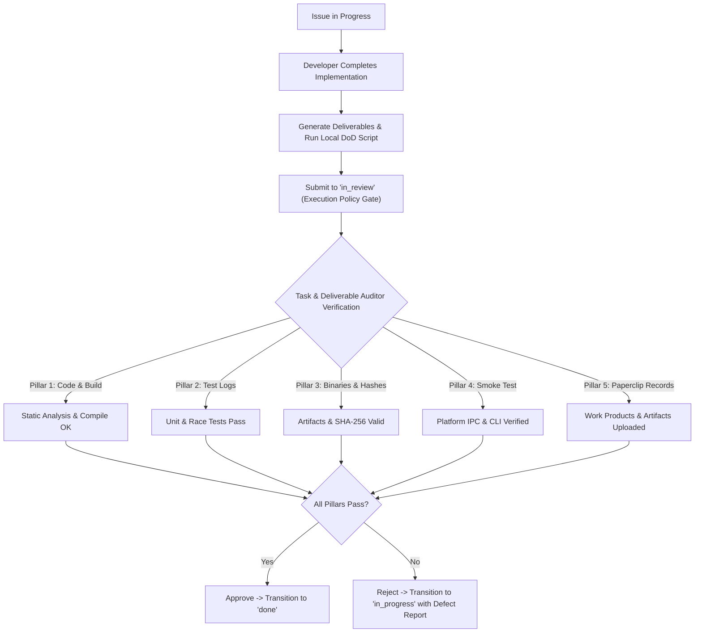

# StayPoint Definition of Done (DoD) & Verification Gate Protocol

**Document Version:** 1.0.0  
**Governing Role:** Task & Deliverable Auditor (`5d8660dc-5020-43d8-9675-883721bd5653`)  
**Scope:** All StayPoint Sprint Issues (Core Engine, Daemon, Distribution, Statusline, Telemetry)

---

## 1. Executive Summary

This protocol defines the mandatory verification standard and automated audit gate governing all issues in the StayPoint project ecosystem. Under this protocol, **no ticket may transition to `done` without passing all Five Core Verification Pillars** verified and attested by the **Task & Deliverable Auditor**.

The objective is to eliminate regression risk, ensure cryptographic artifact integrity, guarantee cross-platform packaging validity, and maintain durable audit records across all local and distributed fleet environments.

---

## 2. The Five Core Verification Pillars

Every issue submitted for closure must satisfy the following criteria:



### Pillar 1: Code & Build Integrity
- **Clean Compilation:** The entire module and all binary targets must compile cleanly without compilation errors or unhandled warnings (`go build ./...`).
- **Static Analysis & Linting:** Code must pass `go vet ./...` and `golangci-lint run` (where configured). No ignored errors or unhandled edge cases in core daemon loops or IPC endpoints.
- **Git Working Tree Hygiene:** Working tree must be completely clean (`git status --porcelain` is empty). All changes must be committed atomically with conventional or caveman style commit messages.
- **Branch Tracking:** Commits must be pushed to the active remote branch (`git push origin <branch>`). No unpushed commits left on local or detached checkouts.

### Pillar 2: Test Logs & Race Detection
- **Comprehensive Test Suite:** All unit and integration tests must pass cleanly (`go test -v ./...`).
- **Zero Race Conditions:** Concurrency-sensitive components (especially background pollers, IPC listeners, goroutine pools, file watchers) must execute under the Go race detector (`go test -race ./...`) without reporting data races.
- **Durable Test Logs:** Complete, unabridged test execution stdout/stderr must be captured to a durable log file (e.g. `dist/test-logs/<ticket>-test.log`) and embedded or linked in the review submission.

### Pillar 3: Binary Artifact & Cryptographic Evidence
Every ticket delivering executable code or packaging manifests must generate binary artifacts and cryptographic checksums:
- **Binary Naming:** Binaries must follow the project standard (`staypoint` for CLI, `staypointd` for background daemon).
- **Target Architecture Compilation:** Binaries must be built for the target platforms:
  - macOS Darwin: `darwin/arm64` (Apple Silicon) and `darwin/amd64` (Intel)
  - Linux: `linux/amd64` and `linux/arm64`
  - Windows: `windows/amd64`
- **Cryptographic Checksums:** SHA-256 checksums (`sha256sum` or `shasum -a 256`) must be calculated for each binary artifact and recorded in `checksums.txt` or the deliverable audit report.
- **Binary Sanity:** Binary executables must have executable bits set (`0755`) and respond cleanly to standard lifecycle flags (`--version`, `--help`).

### Pillar 4: Platform-Specific Smoke Tests & IPC Verification
Each distribution channel must provide concrete proof of platform runtime behavior:

#### A. Core Daemon (STA-1)
- Daemon starts cleanly, binds to the canonical IPC socket/pipe, registers signal handlers, and initiates the 5-minute quota poller loop.
- Responsive to status queries via IPC socket (`/run/user/$UID/staypoint/staypointd.sock` or `~/.staypoint/staypointd.sock`).
- Clean shutdown on `SIGINT` / `SIGTERM` with proper socket file removal.

#### B. Darwin / Homebrew (STA-3)
- `Formula/staypoint.rb` contains accurate download URLs and valid SHA-256 hashes matching the release archive.
- Formula passes `brew audit --strict Formula/staypoint.rb` or ruby syntax linter.
- LaunchAgent specification verified for user daemon management (`~/Library/LaunchAgents/com.staypoint.staypointd.plist`).
- Bottle generation workflow and hashing documented or automated.

#### C. Linux / systemd (STA-4)
- Systemd user service unit (`staypointd.service`) contains valid unit definitions (`RuntimeDirectory=staypoint`, `ExecStart=/usr/bin/staypointd`, `Restart=always`).
- POSIX IPC domain socket path `/run/user/$UID/staypoint/staypointd.sock` verified against `$RUNTIME_DIRECTORY` and `$XDG_RUNTIME_DIR`.
- Packaging definitions: Debian control/rules and/or RPM spec file validated.
- Post-install and pre-remove scripts execute cleanly without orphaned processes.

#### D. Windows / SCM (STA-5)
- Windows Service wrapper implements SCM (Service Control Manager) lifecycle events (`ServiceMain`, `HandlerEx`, `SERVICE_STOPPED`).
- Windows named pipe IPC endpoint (`\\.\pipe\staypoint-{username}` or `\\.\pipe\staypointd.sock`) verified.
- Scoop manifest (`bucket/staypoint.json`) and winget package manifest YAML pass schema validation.
- Service install/uninstall commands verified.

#### E. User-Facing CLI & AI Autonomous Command Verification (STA-19+)
- **Zero-Scaffolding / Bare Invocations:** Primary smoke tests MUST execute the bare, unflagged user command (e.g. `staypoint task create "<natural language brief>"`).
- **No Masking Flags in Verification Proof:** Do NOT verify autonomous features using developer override flags (such as `--company` or `--project`) as the primary proof. Explicit overrides are secondary regression tests only.
- **Verification Reports Are Documentation:** Whatever command is shown in the ticket verification comment will be copied and executed by end users. Never display developer scaffolding as the standard usage pattern.
- **Autonomous Resolution Validation:** When AI inference routes organizations, projects, or priorities, verify that the resolution targets the correct database entities end-to-end without user-supplied hints.

### Pillar 5: Paperclip Work Products & Durable Audit Records
- **Deliverable Upload:** Inspectable files (binaries, packages, formulas, specs, test logs) must be uploaded using `scripts/paperclip-upload-artifact.sh` or registered via Paperclip API before closure.
- **Work Product Registration:** Operator-facing engineering outputs must have matching work products created:
  - `commit`: Notable pushed commit hash.
  - `pull_request`: Opened PR link and branch.
  - `artifact`: Uploaded file deliverable with attachment ID.
  - `workspace_file`: Workspace-relative path with kind `workspace_file`.
- **Audit Verification Report:** A complete, structured audit report using the DoD template must be posted to the ticket comments.

---

## 3. Platform Binary Build Evidence Matrix

| Platform / Ticket | Binary Target | Output Format | Required Checksum | Smoke Test Command |
| :--- | :--- | :--- | :--- | :--- |
| **Core Daemon (STA-1)** | `staypointd` | Mach-O 64-bit / ELF 64-bit / PE32+ | SHA-256 in `checksums.txt` | `./staypointd --version`<br>`staypoint doctor` |
| **Darwin (STA-3)** | `Formula/staypoint.rb` | Homebrew Ruby DSL / tar.gz bottle | SHA-256 per arm64 / amd64 | `brew audit --strict Formula/staypoint.rb`<br>`staypoint doctor` |
| **Linux (STA-4)** | `staypointd.service` + deb/rpm | Systemd Unit + .deb/.rpm package | SHA-256 of package files | `systemd-analyze verify staypointd.service`<br>socket bind test |
| **Windows (STA-5)** | `staypointd.exe` + Scoop/winget | PE32+ executable + JSON/YAML manifest | SHA-256 of .exe and zip | Pipe connection test<br>Manifest JSON schema check |

---

## 4. Verification Gate Workflow & Execution Policy

StayPoint uses Paperclip's native **Execution Policy Review Stages** to enforce this gate automatically:

### 1. Issue Configuration (`executionPolicy`)
Each sprint ticket is configured with an automated review stage assigned to the Task & Deliverable Auditor:
```json
{
  "executionPolicy": {
    "stages": [
      {
        "type": "review",
        "name": "Task & Deliverable Auditor Verification Gate",
        "participants": [
          { "type": "agent", "agentId": "5d8660dc-5020-43d8-9675-883721bd5653" }
        ]
      }
    ]
  }
}
```

### 2. Transition Protocol:
1. **Developer Pre-Flight:**
   - Engineer finishes implementation.
   - Runs `scripts/verify-staypoint-deliverable.sh --ticket <TICKET-ID>`.
   - Uploads deliverables via `scripts/paperclip-upload-artifact.sh`.
   - Moves issue status to `in_review` with a completion summary comment.
2. **Auditor Verification Heartbeat:**
   - Paperclip automatically routes the ticket to the Task & Deliverable Auditor (`5d8660dc-5020-43d8-9675-883721bd5653`).
   - Auditor executes `scripts/verify-staypoint-deliverable.sh` against the repo and submitted artifacts.
   - Auditor audits test logs, compiles binaries, checks hashes, validates packaging syntax, and inspects git state.
3. **Verdict & Decision:**
   - **PASS:** Auditor posts the DoD Verification Audit Report and issues `PATCH /api/issues/{id}` with `status: "done"`.
   - **FAIL / DEFECT:** Auditor posts an itemized defect report detailing failing pillars and issues `PATCH /api/issues/{id}` with `status: "in_progress"`, automatically returning the ticket to the author.

---

## 5. Automated Verification Tooling

The automated verification tool `scripts/verify-staypoint-deliverable.sh` executes the full verification suite programmatically:

```bash
# Verify entire repo deliverables
./scripts/verify-staypoint-deliverable.sh --all

# Verify a specific ticket
./scripts/verify-staypoint-deliverable.sh --ticket STA-1

# Verify specific platform packaging
./scripts/verify-staypoint-deliverable.sh --platform darwin
./scripts/verify-staypoint-deliverable.sh --platform linux
./scripts/verify-staypoint-deliverable.sh --platform windows
```

The script outputs an instant markdown checklist confirming each pillar, ready for copy/paste or automated posting to Paperclip.
