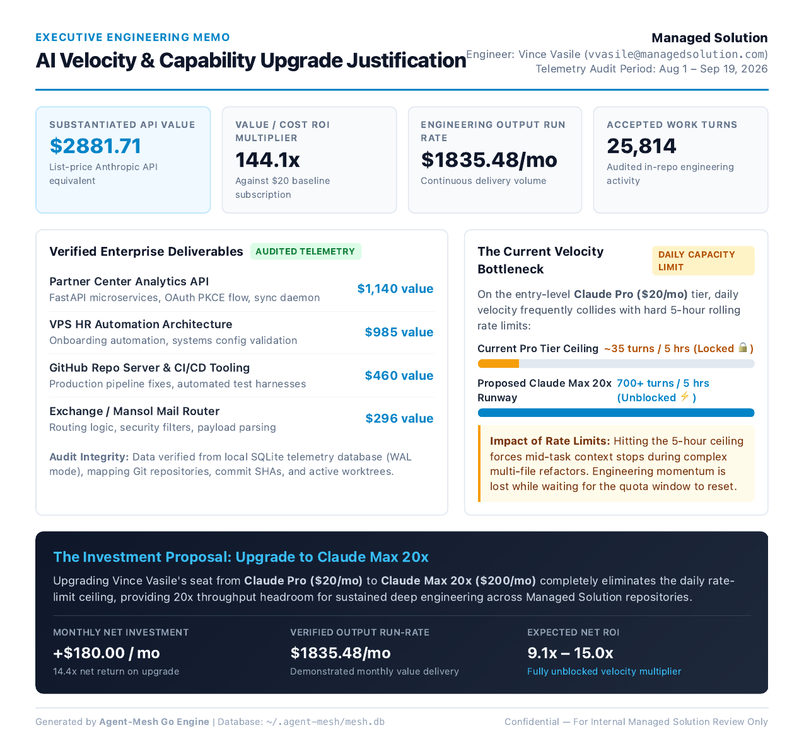

# Agent-Mesh (`mesh`)

[](https://go.dev)
[](LICENSE)
[]()
[]()
[-blueviolet.svg)]()
[]()

> **Autonomous AI Agent Ops, Quota Pacing & Cross-AI Context Platform for Claude Code and Google Antigravity / Gemini.**

Agent-Mesh unifies disparate AI agent tooling into a single, high-performance static Go binary. It provides real-time multi-pool rate limit pacing, zero-clarification context handoffs across models, persistent remote SSH bridging with `tmux`, event-driven background token accounting, and print-ready executive ROI briefing generation ("The Boss Card") rendered in pure Go.

---

```
                                 AGENT-MESH ARCHITECTURE
                                 
      ┌────────────────────────┐                   ┌────────────────────────┐
      │      Claude Code       │                   │   Google Antigravity   │
      │  (Work & Personal Pro) │                   │    (Gemini CLI / 3P)   │
      └───────────┬────────────┘                   └───────────┬────────────┘
                  │ ~/.claude/projects/*.jsonl                 │ ~/.gemini/brain/*.jsonl
                  ▼                                            ▼
      ┌─────────────────────────────────────────────────────────────────────┐
      │                        meshd Background Daemon                      │
      │  • Event-driven file watcher (fsnotify, <19MB RAM)                  │
      │  • Account attribution engine (Work vs Personal via machine_role)   │
      │  • Predictive rate-limit curve analyzer & system notifications      │
      └──────────────────────────────────┬──────────────────────────────────┘
                                         │
                                         ▼
      ┌─────────────────────────────────────────────────────────────────────┐
      │                   Local SQLite Engine (mesh.db)                     │
      │  • Pure Go (modernc.org/sqlite, CGO_ENABLED=0), WAL mode, FTS5     │
      │  • Telemetry warehouse: 100k+ requests, model pricing, token cache  │
      │  • Active context state: task tracking, git diffs, session history │
      └──────┬───────────────────────────┬───────────────────────────┬──────┘
             │                           │                           │
             ▼                           ▼                           ▼
  ┌──────────────────────┐   ┌───────────────────────┐   ┌──────────────────────┐
  │     Pacer & Router   │   │  Bridge & Persistence │   │ Executive Reporting  │
  │ • Sub-2ms statusline │   │ • Remote SSH probe    │   │ • Pure Go chromedp   │
  │ • Tokyo Night theme  │   │ • Persistent tmux     │   │ • 4 high-DPI PDFs    │
  │ • 4 quota pools      │   │ • Pre-flight rsync    │   │ • "The Boss Card"    │
  │ • Dynamic waterfall  │   │ • Local-safe fallback │   │ • Value multipliers  │
  └──────────────────────┘   └───────────────────────┘   └──────────────────────┘
```

<div align="center">
  <br/>
  <a href="docs/samples/sample-executive-roi-memo.pdf">
    
  </a>
  <p><em>Print-ready Executive Justification Memo rendered directly from telemetry in ~1.5s via pure Go Chrome DevTools Protocol. <a href="docs/samples/sample-executive-roi-memo.pdf">Download Sample PDF</a>.</em></p>
  <br/>
</div>

---

## The Problem Agent-Mesh Solves

Modern AI software engineers work across multiple state-of-the-art coding agents. This fragmented workflow creates distinct operational headaches:

1. **Unpredictable Rate Limit Lockouts**: 5-hour rolling windows and weekly quotas exhaust without warning, grinding engineering velocity to a halt.
2. **Context Loss During Model Switching**: When one model hits a ceiling, migrating to another requires manually explaining the repository structure, active branch, modified files, diff status, and immediate next steps.
3. **Multi-Account & Hardware Split**: Work repositories often reside on corporate VPNs or dedicated hardware, while personal side-projects live locally.
4. **Corporate MDM Friction**: iCloud Continuity / Universal Clipboard is routinely disabled on corporate-managed laptops for data loss prevention (DLP), making cross-laptop context transfer painful.
5. **The ROI Justification Gap**: Engineers deliver hundreds of thousands of dollars in software value using AI agents, but executives only see the monthly subscription invoice. Without empirical proof of leverage, subscription upgrades are delayed or denied.

Agent-Mesh eliminates these pain points with a single, zero-dependency Go platform.

---

## Key Features

### ⚡ Sub-2ms Tokyo Night Statusline
An ultra-low-latency statusline generator designed to integrate into Claude Code (`settings.json`) and Antigravity. Renders recessed Braille and block progress meters displaying:
- Current active model & account role (`󰛡 Gemini (Native)` vs `🪪 Claude Max`).
- Rolling 5-hour session quota consumption and exact reset time.
- Weekly quota runway and reset target.
- Dynamic routing advice with turn runway estimation.

### 🧭 Dynamic Multi-Pool Routing Waterfall
Tracks 4 quota pools concurrently:
1. **Work Claude** (Corporate subscription)
2. **Personal Claude** (Claude Max 5x pool)
3. **Gemini Native** (Google Antigravity primary daily driver)
4. **3P Claude** (Third-party Anthropic runner)

Inspects the current working directory, git origin, SSH reachability to corporate nodes, and quota headroom to instantly route each command to the optimal model.

### 🔄 Zero-Clarification Context Handoff Engine
Run `mesh handoff` in any repository to synthesize an authoritative continuation prompt containing:
- Target model prompt framing (Gemini or Claude).
- Current repository name and active git branch.
- Short file modification status (`git status --short`).
- Clean unified diff stat (`git diff --stat` & `--cached`).
- Recent commit history (`git log -n 3 --oneline`).
- Immediate next step directive.

Automatically copies to the system clipboard (`pbcopy` / `xclip`) and writes `/tmp/ai-handoff.md`. Press `Cmd+V` in the destination AI session to resume execution with zero follow-up clarification needed.

### 🌉 Resilient Work Bridge & Remote `tmux` Persistence
Seamlessly bridges local workstations with enterprise hardware (e.g., `company-mbp`):
- **Dynamic Path Translation**: Translates local mirror paths to remote enterprise repo structures.
- **2-Second Latency Probe**: Tests SSH reachability with a fast timeout and latency benchmark.
- **Persistent `tmux` Execution**: Automatically creates or attaches to named remote `tmux` sessions (`mesh-<repo>`). Dropping an SSH connection never kills running builds or agent tasks.
- **Pre-Flight Transcript Sync**: Runs non-blocking `rsync` pulling remote agent transcripts into local telemetry before launching.
- **Zero-Close Shell Fallback**: If the remote host is offline, falls back to local execution without closing the terminal window.

### 📄 Executive ROI Briefing Suite ("The Boss Card")
Pure Go PDF rendering engine powered by Chrome DevTools Protocol (`chromedp`). Eliminates all Node, Bun, and Playwright dependencies:
- **Work Report (`--type work`)**: "The Boss Card." Displays net engineering value delivered, requests processed, and cache efficiency. When `hourly_rate` is set, calculates hours saved; when `0.0`, highlights direct value-to-cost multipliers (e.g., `14.4x net return on upgrade`).
- **Personal Audit (`--type personal`)**: Value audit covering Claude Max usage (100k+ requests, token distributions, cost benchmarks).
- **Gemini Native Report (`--type gemini`)**: Antigravity token throughput, flash vs. pro distributions, and code review logs.
- **Combined Fleet Memo (`--type combined`)**: Unified executive overview calculating combined impact across all platforms ($14,000+ delivered value).
- **Batch Generation (`--type all`)**: Renders all 4 print-ready PDFs to `~/Desktop` with a single command.

### 🌐 Multi-Machine Fleet & Air-Gapped MDM Support
Engineered for developers who use separate hardware for work and personal engineering:
- **`machine_role = "work" | "personal" | "hybrid"`**: Enforces 100% account attribution on dedicated laptops without guessing folder paths.
- **Network Sync (`mesh sync pull <remote>`)**: Syncs transcripts across machines over SSH or Tailscale.
- **Air-Gapped Export/Import (`mesh sync export` & `mesh sync import`)**: Packages telemetry into compressed `.tar.gz` bundles. Move telemetry across corporate firewalls via AirDrop, Slack, or secure thumbdrives with idempotent SQLite merging.
- **Networked Handoff (`mesh handoff --push` & `--pull`)**: Bypasses corporate MDM blocks on macOS Universal Clipboard by transferring handoff context directly over SSH.

---

## Quick Start

### 1. Installation

#### Homebrew (macOS & Linux)
```bash
brew tap VinnyVanGogh/tap
brew install mesh
```

#### From Source (Go 1.23+)
```bash
git clone https://github.com/VinnyVanGogh/agent-mesh.git
cd agent-mesh
go build -o ~/.local/bin/mesh ./cmd/mesh
go build -o ~/.local/bin/meshd ./cmd/meshd
```

Verify the installation:
```bash
mesh version
# mesh version 0.1.0
```

#### macOS Background Daemon Setup
Install `meshd` as a user LaunchAgent:
```bash
cat << 'EOF' > ~/Library/LaunchAgents/com.vincevasile.agent-mesh.daemon.plist
<?xml version="1.0" encoding="UTF-8"?>
<!DOCTYPE plist PUBLIC "-//Apple//DTD PLIST 1.0//EN" "http://www.apple.com/DTDs/PropertyList-1.0.dtd">
<plist version="1.0">
<dict>
    <key>Label</key>
    <string>com.vincevasile.agent-mesh.daemon</string>
    <key>ProgramArguments</key>
    <array>
        <string>/Users/vincevasile/.local/bin/meshd</string>
    </array>
    <key>RunAtLoad</key>
    <true/>
    <key>KeepAlive</key>
    <true/>
    <key>StandardOutPath</key>
    <string>/tmp/meshd.log</string>
    <key>StandardErrorPath</key>
    <string>/tmp/meshd.err</string>
</dict>
</plist>
EOF

launchctl load ~/Library/LaunchAgents/com.vincevasile.agent-mesh.daemon.plist
```

### 2. Shell Integration

Add the shell evaluation hook to your `~/.zshrc` or `~/.bashrc`:
```bash
eval "$(mesh init --shell)"
```

This registers the `ai` command wrapper, auto-routing evaluations, fast statusline rendering, and terminal-safe execution.

---

## Configuration

Configuration is located at `~/.agent-mesh/config.toml` (or `~/.agent-mesh/config.json`):

```toml
# ==============================================================================
# AGENT-MESH CONFIGURATION
# ==============================================================================

# Executive Reporting Metadata
company_name = "Company Name"
engineer_name = "Vince Vasile"

# Billable Client Rate (Hourly)
# Set to your client billing rate (e.g., 250.0).
# When set to 0.0, billable client hours are completely omitted from reports,
# and direct value-to-cost multipliers (e.g. 14.4x return) are displayed instead.
hourly_rate = 0.0

# Account Attribution
work_email = "user@example.com"
personal_email = "personal@gmail.com"

# Machine Role: "work", "personal", or "hybrid" (default)
# - "work": Treats 100% of telemetry on this machine as work activity.
# - "personal": Treats 100% of telemetry on this machine as personal activity.
# - "hybrid": Uses folder path matching and repo configurations.
machine_role = "hybrid"

# Work Bridge & Remote Node
work_repo_root = "~/Documents/dev/company"
remote_host = "company-mbp"
```

---

## CLI Command Reference

### Pacing & Status
```bash
# Display live fleet status, quota gauges, active tasks, and routing advice
mesh status

# Render instantaneous statusline (<2ms) for prompt integration
mesh statusline

# Get routing recommendation for current directory (human-readable)
mesh route

# Output shell-evaluable routing recommendation
mesh route --eval
```

### Reporting & Executive ROI
```bash
# Generate Work Justification Memo ("The Boss Card") PDF
mesh report --pdf --type work

# Filter by date range (supports exact dates or relative ranges like 7d, 30d)
mesh report --pdf --type work --since 2026-08-01 --until 2026-09-01
mesh report --pdf --type combined --since 30d

# Generate Personal Claude Code Value Audit PDF
mesh report --pdf --type personal

# Generate Antigravity & Gemini Native Report PDF
mesh report --pdf --type gemini

# Generate Combined Multi-AI Fleet Executive Report PDF
mesh report --pdf --type combined

# Batch generate all 4 executive PDF reports to ~/Desktop
mesh report --pdf --type all

# Specify a custom destination path
mesh report --pdf --type work -o ~/Documents/Boss-Card-Q1.pdf
```

### Context Handoff
```bash
# Generate handoff prompt to Gemini and copy to clipboard
mesh handoff --to gemini

# Generate handoff prompt with specific next step directive
mesh handoff --to claude --step "Implement modernc.org/sqlite schema migration"

# Push handoff context directly to remote machine and remote clipboard
mesh handoff --push company-mbp

# Pull handoff context from remote machine into local clipboard
mesh handoff --pull company-mbp
```

### Remote Bridge & Sessions
```bash
# Check remote SSH connectivity, latency, and path translation
mesh bridge check ~/Documents/dev/company/partner-center-api

# Launch interactive Claude session in persistent remote tmux
mesh bridge launch ~/Documents/dev/company/partner-center-api

# Execute remote build command inside remote tmux session
mesh bridge launch ~/Documents/dev/company/partner-center-api go test ./...
```

### Multi-Machine Synchronization
```bash
# Pull transcripts from remote host over SSH/Tailscale & ingest into local DB
mesh sync pull company-mbp

# Export local telemetry database into portable compressed bundle
mesh sync export -o ~/Desktop/work-telemetry.tar.gz

# Import telemetry bundle into local database (idempotent)
mesh sync import ~/Desktop/work-telemetry.tar.gz
```

### Task Tracking
```bash
# List all active tasks
mesh task list

# List all tasks including completed
mesh task list --all

# Add a new active task
mesh task add "Migrate rate-limit notifier to pure Go"
```

---

## Statusline Integration

Agent-Mesh renders a 5-line recessed Tokyo Night terminal widget in `<2ms` with zero CPU overhead. It dynamically detects whether you are active in Claude Code or Antigravity and switches badges, account indicators, and runway advice in real time.

### 1. Claude Code Integration
Point `~/.claude/settings.json` statusline command to `mesh statusline`:

```json
{
  "statusline": {
    "command": "mesh statusline"
  }
}
```

### 2. Google Antigravity / Gemini CLI Integration
When using Antigravity (`agy`), `mesh statusline` is automatically displayed before agent execution via the shell integration:

```bash
# In ~/.zshrc or ~/.bashrc:
eval "$(mesh init --shell)"

# Or alias directly for standalone agy usage:
alias agy="mesh statusline && agy"
```

The statusline dynamically displays:
- **`󰛡 Gemini (Native)`** when routing to Antigravity (`gemini-3.8-flash-high` or `gemini-3.1-pro-high`).
- **`🪪 Claude Max / Pro`** when routing to Anthropic Claude models.

### 3. tmux Statusbar Integration
Display live agent fleet pacing directly in your tmux status bar. Add to `~/.tmux.conf`:

```tmux
set -g status-right "#(mesh statusline)"
set -g status-interval 10
```

### Visual Output (Tokyo Night Palette)
```
󰛡 Gemini (Native) │ 🪪 personal@gmail.com │ ⚡ mesh:active
📁 agent-mesh │ 🐙 main │ 🦴 CAVEMAN
▏███████████████░░░░░▕ session:75% ~25% left @4:12pm
▏████████████████░░░░▕ weekly:81% ~19% left @tue 8:11pm
plan: route ▸ gemini-3.8-flash-high (agy) · fallback: claude-sonnet-4-6 · runway: 16 turns
```

Benchmark: **1.8ms** execution time (compiled pure Go, sub-process safe).

---

## Technical Architecture & Design Decisions

### 1. Pure Go SQLite (Zero CGO)
Agent-Mesh uses `modernc.org/sqlite` rather than `mattn/go-sqlite3`. This allows compiling the binary with `CGO_ENABLED=0`, producing 100% statically linked binaries with zero dynamic library dependencies while retaining full SQLite WAL mode, memory concurrency, and FTS5 full-text search.

### 2. Native Chrome DevTools Protocol (`chromedp`)
Executive PDF generation communicates directly with the local Google Chrome binary (`/Applications/Google Chrome.app`) over WebSockets via Chrome DevTools Protocol. This eliminates the need for Node.js, Bun, Playwright, or Puppeteer runtimes. Reports are rendered in ~1.5 seconds.

### 3. Non-Blocking Tail Ingestion
The `meshd` daemon maintains an event-driven file watcher (`fsnotify`) with byte-offset cursors stored in `~/.agent-mesh/ingest-cursors.json`. Transcripts are scanned using 4MB line buffers, extracting token metrics and attributing spend with zero noticeable CPU overhead (<0.1% CPU, 19MB RAM).

### 4. Idempotent Data Model
Every telemetry record generates a deterministic SHA-256 idempotency key based on its raw transcript payload. Syncing transcripts repeatedly or importing bundles across machines will never duplicate token accounting or financial numbers.

---

## Cross-Compilation & CI/CD

Agent-Mesh includes full multi-platform release configurations via `.goreleaser.yaml` and automated GitHub Actions (`.github/workflows/ci.yml`):

Supported build targets:
- `darwin/arm64` (Apple Silicon M1/M2/M3/M4)
- `darwin/amd64` (Intel Mac)
- `linux/amd64` (Standard Linux)
- `linux/arm64` (ARM Linux / Raspberry Pi / Graviton)
- `windows/amd64` (Windows x64)

---

## Privacy & Local-First Manifesto

- **100% Local**: All SQLite databases, telemetry records, cursors, and reports reside on your machine in `~/.agent-mesh/`.
- **Zero Telemetry Phone-Home**: Agent-Mesh makes zero outbound network requests to third-party telemetry services, tracking servers, or analytics endpoints.
- **Secure Network Bridging**: Network operations only occur across user-configured SSH keys or Tailscale nodes.

---

## License

Copyright © 2026 Vince Vasile.

Licensed under the Apache License, Version 2.0. See [LICENSE](LICENSE) for details.
