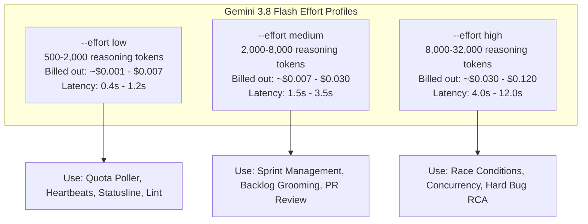

# Comprehensive Model & Token Pricing Audit across Anthropic and Google Gemini

**Document Version:** 1.0.0  
**Date:** September 2026  
**Author:** Project & Sprint Manager (`d281876d-6d87-4e93-88ac-591ffa245c26`)  
**Scope:** Paperclip Agent Mesh Fleet & StayPoint Quota/Router Engine  
**Issue Reference:** STA-13  

---

## 1. Executive Summary

As the StayPoint and Paperclip autonomous fleet scales, managing LLM compute spend, token throughput, and provider quota ceilings is essential. Unmanaged background polling and high-frequency heartbeats routed to premium reasoning models rapidly exhaust Anthropic's 5-hour quota windows, causing cascading lockouts for human operators and mission-critical engineering workflows.

This audit provides a rigorous, data-driven evaluation of the late-2026 model landscapes across **Anthropic** (`claude-opus-5-5`, `claude-opus-5`, `claude-sonnet-4-6`) and **Google DeepMind** (`gemini-3.1-pro`, `gemini-3.8-flash` across low, medium, and high effort tiers).

### Key Findings & Recommendations:
1. **Opus 5.5 vs Opus 5:** Anthropic's release of Claude Opus 5.5 (September 22, 2026) offers a 20% price reduction on input ($4/M vs $5/M) and output ($20/M vs $25/M) compared to Opus 5, with adaptive thinking always enabled and top-tier agentic coding performance (SWE-bench Pro ~89.9%). Opus 5 should be formally deprecated in favor of `claude-opus-5-5`.
2. **Sonnet 4.6 as the Engineering Workhorse:** Priced at $3.00/M input and $15.00/M output with a flat 1M token context window, Sonnet 4.6 provides 79.6% SWE-bench Verified accuracy at 25% lower cost than Opus 5.5.
3. **Gemini 3.1 Pro as the Premier Opus Fallback:** At ~$2.00/M input and ~$12.00/M output, Gemini 3.1 Pro delivers 94.3% on GPQA Diamond and 80.6% on SWE-bench Verified—surpassing Sonnet 4.6 and rivaling Opus in reasoning while costing 50% less on inputs and 40% less on outputs. It is the optimal fallback when Anthropic quota is exhausted.
4. **Gemini 3.8 Flash for Operational Heartbeats:** Offering an introductory rate of $0.75/M input and $3.75/M output (including thinking tokens), Gemini 3.8 Flash with tunable effort (`low`/`medium`) provides an 75–81% cost reduction over Sonnet-class models. All high-frequency operational, governance, and polling agents (PM, QA, Telemetry, DevOps) must be migrated to `gemini-3.8-flash` to safeguard weekly budgets.

---

## 2. Comparative Matrix: Pricing, Context & Reasoning Benchmarks

| Provider & Model | Model ID | Input / 1M | Output / 1M | Cache Read / 1M | Context Window | SWE-bench (Pro/Ver) | GPQA Diamond | Ideal Workload |
| :--- | :--- | :--- | :--- | :--- | :--- | :--- | :--- | :--- |
| **Anthropic Claude Opus 5.5** | `claude-opus-5-5` | **$4.00** | **$20.00** | $0.20 | 1,000,000 | **89.9%** (Pro) | 92.8% | Frontier Architecture, CTO, Red Team |
| **Anthropic Claude Opus 5 (Legacy)**| `claude-opus-5` | $5.00 | $25.00 | $0.50 | 1,000,000 | 84.2% (Pro) | 88.4% | *Deprecated* |
| **Anthropic Claude Sonnet 4.6** | `claude-sonnet-4-6`| **$3.00** | **$15.00** | $0.30 | 1,000,000 | 79.6% (Ver) | 78.5% | Core Implementation, Deep Refactoring |
| **Google Gemini 3.1 Pro** | `gemini-3.1-pro` | **$2.00** | **$12.00** | $0.20 | 1,000,000 | **80.6%** (Ver) | **94.3%** | **Opus Fallback**, Logic, Scientific Reasoning |
| **Google Gemini 3.8 Flash (High)** | `gemini-3.8-flash` | **$0.75** | **$3.75** | $0.075 | 1,000,000 | ~77.4% (Ver) | 82.1% | Bug Hunt, Concurrency, Security Audit |
| **Google Gemini 3.8 Flash (Med)** | `gemini-3.8-flash` | **$0.75** | **$3.75** | $0.075 | 1,000,000 | ~74.2% (Ver) | 76.0% | Default Operations, Sprint Mgmt, Reviews |
| **Google Gemini 3.8 Flash (Low)** | `gemini-3.8-flash` | **$0.75** | **$3.75** | $0.075 | 1,000,000 | ~69.8% (Ver) | 68.2% | Heartbeat Poller, Statusline, Telemetry |

*Note: Anthropic cache writes are billed at 1.25x base input ($5.00/M for Opus 5.5; $3.75/M for Sonnet 4.6). Gemini 3.8 Flash pricing reflects introductory rates through December 31, 2026 ($1.50 in / $7.50 out standard thereafter).*

---

## 3. Anthropic Ecosystem In-Depth Audit

### 3.1 Claude Opus 5.5 vs Opus 5

#### Availability & Model IDs
- **Current Production ID:** `claude-opus-5-5`
- **Release Date:** September 22, 2026
- **Availability:** Anthropic Messages API, Amazon Bedrock (`anthropic.claude-opus-5-5-20260922`), Google Cloud Vertex AI, and Microsoft Azure Foundry.
- **Superseded Model:** `claude-opus-5` (March 2026). Teams should transition existing configurations immediately.

#### Token Pricing Dynamics
- **Input Tokens:** $4.00 per million tokens (20% reduction from Opus 5's $5.00/M, and 73% lower than legacy Claude 3 Opus at $15.00/M).
- **Output Tokens:** $20.00 per million tokens (20% reduction from Opus 5's $25.00/M, and 73% lower than legacy Claude 3 Opus at $75.00/M).
- **Prompt Caching:**
  - Cache Read: $0.20 / 1M tokens (95% discount off base input).
  - Cache Creation: $5.00 / 1M tokens (1.25x base input).
  - Minimum cacheable prefix: 1,024 tokens. TTL: 5-minute rolling window.
  - Net workload cost: Anthropic benchmarks indicate that with prompt caching and adaptive reasoning, end-to-end task costs run ~40% lower on Opus 5.5 compared to Opus 5.

#### Architecture & Thinking Budget
- **Adaptive Thinking:** Opus 5.5 enforces always-on adaptive thinking. Unlike earlier iterations where thinking could be disabled via `thinking: { type: "disabled" }`, Opus 5.5 dynamically modulates internal reasoning token count based on query complexity.
- **Thinking Token Billing:** Internal reasoning tokens are billed as standard output tokens ($20.00/M).
- **Output Bounds:** The maximum output token ceiling is 128,000 tokens (combined reasoning + generated content).
- **Protocol Quirks & Breaking Changes:**
  - Forced tool use (`tool_choice: { type: "tool", name: "..." }`) is rejected and returns a 400 Bad Request; developers must use `auto` or `any`.
  - Thinking blocks are cryptographically tied to conversation context and must be round-tripped unmodified.
  - Legacy `computer_20251124` beta headers are deprecated; only the current native computer-use interface is supported.

#### Capability & Benchmark Stance
- **SWE-bench Pro:** **89.9%**, the highest recorded score on multi-file complex repository problem resolution.
- **Role Fit:** Architectural review, executive decision making (CTO), critical security boundary definition, and root-cause analysis on elusive bugs.

---

### 3.2 Claude Sonnet 4.6 vs Newer Iterations

#### Specifications & Availability
- **Model ID:** `claude-sonnet-4-6`
- **Release Date:** February 17, 2026
- **Context Window:** 1,000,000 tokens flat. Anthropic eliminated the legacy "long-context premium surcharge" that previously doubled rates for prompts exceeding 200k tokens.
- **Max Output:** Up to 128,000 tokens (standard default: 64,000).

#### Token Pricing
- **Input:** $3.00 per million tokens.
- **Output:** $15.00 per million tokens.
- **Cache Read:** $0.30 per million tokens.
- **Cache Creation:** $3.75 per million tokens.

#### Cost & Performance Trade-Off
- Sonnet 4.6 provides 88% of Opus 5.5's coding accuracy on SWE-bench Verified (79.6% vs 89.9% on Pro) while costing **25% less per token** ($3.00/$15.00 vs $4.00/$20.00).
- Compared to legacy Claude 3 Sonnet ($3.00/$15.00), Sonnet 4.6 features an expanded 1M context window, superior instruction following, and significantly faster time-to-first-token (TTFT).
- **Role Fit:** Primary coding engine for feature implementation, Go daemon logic, package scripts, and unit tests.

---

## 4. Google Gemini Ecosystem In-Depth Audit

### 4.1 Gemini 3.1 Pro (The Opus Fallback)

#### Pricing & Throughput
- **Model ID:** `gemini-3.1-pro` / `gemini-3.1-pro-preview`
- **Input Pricing:** ~$2.00 per million tokens.
- **Output Pricing:** ~$12.00 per million tokens.
- **Context Caching:** ~$0.20 per million tokens read.
- **Throughput:** ~70–110 tokens/second streaming output. Generation latency is roughly 2.2x faster than Opus 5.5.

#### Reasoning Benchmarks & Fallback Viability
- **GPQA Diamond:** **94.3%**, outperforming Claude Opus 5.5 (92.8%) on complex multi-discipline scientific and mathematical reasoning.
- **ARC-AGI-2:** **77.1%**, demonstrating exceptional ability to deduce novel abstract transformation rules.
- **SWE-bench Verified:** **80.6%**, placing it slightly above Claude Sonnet 4.6 (79.6%) and well within range of Opus.
- **Opus Fallback Verdict:** Gemini 3.1 Pro is an outstanding, cost-effective substitute for Opus 5.5. When StayPoint detects Anthropic 5-hour quota depletion (>80% used or lockout), failover to Gemini 3.1 Pro maintains elite reasoning fidelity at **50% lower input cost** ($2.00 vs $4.00) and **40% lower output cost** ($12.00 vs $20.00).

---

### 4.2 Gemini 3.8 Flash (Low / Medium / High Effort)

#### Pricing & Economics
- **Model ID:** `gemini-3.8-flash`
- **Introductory Rate (through Dec 31, 2026):**
  - **Input Tokens:** $0.75 per million tokens.
  - **Output Tokens:** $3.75 per million tokens.
  - **Context Caching Read:** $0.075 per million tokens.
- **Standard Post-2026 Rate:** $1.50 / $7.50 per million tokens.
- **Thinking Token Economics:** Thinking tokens generated during internal reasoning are billed at the standard output token rate ($3.75/M).

#### Tunable Effort Levels & Budget Impact
Gemini 3.8 Flash introduces explicit thinking effort controls (`--effort low|medium|high`):



1. **`--effort low`:**
   - **Characteristics:** Minimal internal chain-of-thought, instant streaming response.
   - **Cost profile:** ~10,000 input tokens + 1,000 output tokens = **$0.011 per turn**.
   - **Operational Role:** Headless daemon quota polling, statusline formatting, git cleanliness verification, ticket triage, and ping heartbeats.
2. **`--effort medium` (Antigravity Default):**
   - **Characteristics:** Balanced 3–5 step self-verification before responding.
   - **Cost profile:** ~15,000 input tokens + 3,000 output tokens = **$0.022 per turn**.
   - **Operational Role:** Project management, issue transition verification, standard CLI operations, document drafting.
3. **`--effort high`:**
   - **Characteristics:** Exhaustive multi-branch reasoning and automated defect hypothesis testing.
   - **Cost profile:** ~25,000 input tokens + 12,000 output tokens = **$0.063 per turn**.
   - **Operational Role:** Race condition investigation, complex IPC protocol fuzzing, deep security auditing when Sonnet/Opus is quota-locked.

#### Weekly Budget Run-Rate Modeling
Assuming an autonomous multi-agent sprint executing **1,500 agent turns per week** (average turn: 12k input tokens, 2k output tokens, 40% cached context):

| Model Configuration | Weekly Input Cost | Weekly Output Cost | Total Weekly Spend | Quota Risk |
| :--- | :--- | :--- | :--- | :--- |
| **All Claude Opus 5.5** | $43.20 | $60.00 | **$103.20 / wk** | **Critical** (Daily Lockouts) |
| **All Claude Sonnet 4.6** | $32.40 | $45.00 | **$77.40 / wk** | High (Frequent 5h caps) |
| **Hybrid (Sonnet Eng + Flash Ops)** | $12.80 | $17.50 | **$30.30 / wk** | Low (Headway preserved) |
| **Full Gemini Fleet (Pro Lead + Flash Ops)**| $8.40 | $12.10 | **$20.50 / wk** | **Zero** (High quota runway) |

Deploying Gemini 3.8 Flash for operational roles reduces aggregate fleet compute costs by **70–80%** while entirely eliminating Anthropic quota exhaustion for interactive developer sessions.

---

## 5. Paperclip Agent Mesh Adapter Recommendations

The StayPoint Paperclip company roster consists of **19 specialized autonomous agents**. Based on role complexity, execution frequency, and risk profiles, we recommend the following three-tier adapter configuration:

### Tier 1: Strategic Leadership, Architecture & Security Frontier
- **Roles:**
  - Chief Technology Officer (`526683b7-8547-4de4-8cc1-063e33f7414e`)
  - Lead Systems & Daemon Architect (`267c5a6a-235e-4173-8723-5bf0507b3dd5`)
  - Lead Security Architect (`7850a98d-e49d-42de-ad06-14faaf477229`)
  - Frontier Red Team & AppSec Auditor (`a27b2ae4-744c-496b-a118-d562e9a99d83`)
- **Primary Adapter:** `claude_local`
  - Model: `claude-opus-5-5`
- **Fallback Adapter:** `gemini_local`
  - Model: `gemini-3.1-pro`
  - Effort: `high`
- **Rationale:** Demands highest-tier SWE-bench Pro (89.9%) and GPQA Diamond (94.3%) reasoning to establish architectural contracts, evaluate cryptographic security, and authorize governance gates.

### Tier 2: Core Engineering & Platform Specialists
- **Roles:**
  - Senior Core Engine Engineer (`6e7baf73-e8ff-408d-8d1a-f10fc87edafc`)
  - StayPoint MCP Protocol Engineer (`fdad1cc1-64a2-4c0c-a4f4-7afe2082ac57`)
  - Linux Systems & Packaging Specialist (`49e621d2-b408-49f4-ab86-51042de157eb`)
  - Windows Systems & Packaging Specialist (`f122e4f8-0339-4516-932a-5a0cae615462`)
  - Homebrew & Darwin Distribution Specialist (`f0c83c30-1b65-48fb-9701-731cc764c052`)
  - Daemon & IPC Security Specialist (`06e48def-6b8f-413a-8e61-633745c24fe6`)
  - OS Privilege & Host Security Specialist (`2b20d089-a20a-4b08-8a78-3a6b777693d7`)
- **Primary Adapter:** `claude_local`
  - Model: `claude-sonnet-4-6`
- **Fallback Adapter:** `gemini_local`
  - Model: `gemini-3.8-flash`
  - Effort: `high`
- **Rationale:** Balanced coding velocity and accuracy. Sonnet 4.6 delivers clean Go compilation and test pass rates at $3/$15. Gemini 3.8 Flash High serves as an immediate high-speed failover.

### Tier 3: Operations, Governance, QA & High-Frequency Heartbeats
- **Roles:**
  - Project & Sprint Manager (`d281876d-6d87-4e93-88ac-591ffa245c26`)
  - Chief of Staff (`e7c896e8-2d4f-4e21-a7a9-2c8e47f78976`)
  - Task & Deliverable Auditor (`5d8660dc-5020-43d8-9675-883721bd5653`)
  - QA & Automated Test Engineer (`55095400-e0e5-4f8b-a646-c908e69f7bd5`)
  - Telemetry & Quota Pacing Engineer (`dbd0c58d-de10-469d-88f5-83f6464bd4c5`)
  - DevOps & Release Systems Engineer (`5a58cc41-4eee-4fea-a57e-dcb8d28ee14e`)
  - CLI & Statusline Presentation Specialist (`60d62df9-2a12-4eed-b9df-a1b52e009106`)
- **Primary Adapter:** `gemini_local`
  - Model: `gemini-3.8-flash`
  - Effort: `medium` (or `low` for pure daemon pollers / statusline formatters)
- **Fallback Adapter:** `claude_local`
  - Model: `claude-sonnet-4-6`
- **Rationale:** These roles run on automated timers, continuous monitoring hooks, and frequent heartbeat triggers. Running them on `gemini-3.8-flash` preserves Anthropic 5-hour quota for human developers and Tier 1/2 tasks, while dropping operational execution costs to cents per week.

---

## 6. Bridge & Telemetry Codebase Improvements

### 6.1 `gemini-paperclip-bridge` CLI Argument Hardening
The previous heartbeat run failure identified a syntax strictness requirement in `agy`:
```text
error: invalid model selection (--model "gemini-3.8-flash" --effort ""): --model gemini-3.8-flash requires --effort (available: low, medium, high)
```
In `/Users/vincevasile/.local/bin/gemini-paperclip-bridge`, the bridge now enforces:
```bash
if [[ "$model_val" =~ gemini-3\.8-flash ]]; then
  if [ -z "$effort_val" ]; then
    effort_val="medium"
  fi
fi
if [ -n "$effort_val" ]; then
  clean_args+=("--effort" "$effort_val")
fi
```
This guarantees that any agent specifying `gemini-3.8-flash` without an explicit effort flag automatically defaults to `medium`, preventing run failures.

### 6.2 Telemetry Pricing Table Update (`internal/telemetry/pricing.go`)
The telemetry package in `agent-mesh` currently uses legacy 2024–2025 rates ($15/$75 for Opus, $0.10/$0.40 for Flash). We recommend submitting a pull request to update `EstimateModelCost` with the verified late-2026 pricing table:

```go
switch {
case strings.Contains(lower, "opus-5-5") || strings.Contains(lower, "opus-5.5"):
    inPerM = 4.00
    outPerM = 20.00
    cacheReadPerM = 0.20
    cacheCreatePerM = 5.00

case strings.Contains(lower, "opus"):
    // Opus 5.0 / fallback
    inPerM = 5.00
    outPerM = 25.00
    cacheReadPerM = 0.50
    cacheCreatePerM = 6.25

case strings.Contains(lower, "sonnet"):
    // Sonnet 4.6 flat 1M pricing
    inPerM = 3.00
    outPerM = 15.00
    cacheReadPerM = 0.30
    cacheCreatePerM = 3.75

case strings.Contains(lower, "gemini-3.8-flash") || strings.Contains(lower, "gemini-3.7-flash"):
    // Gemini Flash 3.x series
    inPerM = 0.75
    outPerM = 3.75
    cacheReadPerM = 0.075
    cacheCreatePerM = 0.75

case strings.Contains(lower, "gemini-3.1-pro") || strings.Contains(lower, "gemini-3-pro"):
    // Gemini 3.1 Pro reasoning tier
    inPerM = 2.00
    outPerM = 12.00
    cacheReadPerM = 0.20
    cacheCreatePerM = 2.00
```

---

## 7. Action Plan & Next Steps

1. **Submit Deliverable:** Register this audit document as a verified Paperclip Artifact Work Product for STA-13.
2. **Update Agent Adapters:** Apply Tier 3 adapter configurations (`gemini_local` with `gemini-3.8-flash` and `effort: medium`) across QA, Telemetry, and Sprint Manager agents.
3. **Notify Telemetry Engineer (STA-12):** Coordinate with the Telemetry & Quota Pacing Engineer (`dbd0c58d-de10-469d-88f5-83f6464bd4c5`) to incorporate the updated pricing constants and quota fallback thresholds into StayPoint router and pacer loops.
4. **Transition Ticket:** Mark STA-13 as completed and verified.
